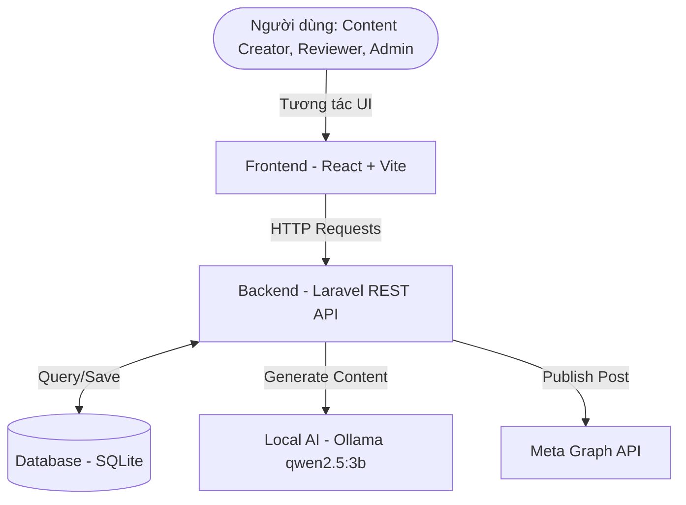

# Kiến trúc Hệ thống - AI Facebook Content Tool

## Tổng quan hệ thống
AI Facebook Content Tool là hệ thống nội bộ hỗ trợ doanh nghiệp tự động hóa quá trình sáng tạo nội dung (bằng AI) và đăng bài lên các Fanpage trên Facebook. Hệ thống được chia thành 3 phần chính:
- **Frontend**: Ứng dụng Single Page Application (SPA) xây dựng bằng React + Vite, chịu trách nhiệm giao tiếp với người dùng.
- **Backend**: API Server xây dựng bằng Laravel, xử lý logic nghiệp vụ, giao tiếp với Database, AI (Ollama), và Meta Graph API.
- **Database**: SQLite (Giai đoạn MVP/Sprint 0) để lưu trữ người dùng, thương hiệu, template, bài viết, và lịch đăng.

## Sơ đồ Kiến trúc

## Trách nhiệm của các thành phần
1. **Frontend (React)**: Quản lý trạng thái giao diện (Form, Dashboard, Phân trang), xác thực dữ liệu đầu vào (cơ bản), và hiển thị lỗi thân thiện.
2. **Backend (Laravel)**:
   - Validate dữ liệu đầu vào.
   - Quản lý phiên và xác thực (dự kiến tích hợp sau).
   - Đóng gói Prompt và giao tiếp với Ollama (thông qua service riêng).
   - Xử lý việc đăng bài lập lịch sử dụng Laravel Scheduler / Queue (dự kiến).
   - Giao tiếp với Meta Graph API.
3. **Database**: Lưu trữ cấu hình Brand, lịch sử bài đăng, token Facebook, v.v.

## Các luồng nghiệp vụ chính
### 1. Luồng tạo Content
- **Bước 1**: Người dùng nhập form (chủ đề, thông tin, khách hàng mục tiêu, giọng văn, mục tiêu...).
- **Bước 2**: Frontend gửi POST tới `/api/content/generate`.
- **Bước 3**: Backend validate, format lại prompt chuẩn và gửi request HTTP tới Ollama `http://localhost:11434`.
- **Bước 4**: Ollama trả về kết quả JSON. Backend phân tích, format và trả kết quả cho Frontend hiển thị.
- **Bước 5**: Người dùng xem, sao chép hoặc lưu bản nháp.

### 2. Luồng duyệt bài (Dự kiến Sprint sau)
- Content Creator lưu bài nháp -> Trạng thái: `pending_review`.
- Reviewer vào xem -> Có thể `approved` hoặc `revision_required`.

### 3. Luồng đăng bài (Dự kiến Sprint sau)
- Người dùng chọn bài viết (`approved`) -> chọn Page -> Bấm "Đăng ngay".
- Backend gọi Meta Graph API -> Nhận ID bài đăng -> Lưu lịch sử vào `publication_logs` và đổi trạng thái bài thành `published`.

### 4. Luồng lên lịch (Dự kiến Sprint sau)
- Người dùng hẹn giờ đăng -> Lưu vào `post_schedules` với trạng thái `scheduled`.
- Laravel Scheduler chạy mỗi phút (hoặc cron job) tìm các bài tới giờ -> Đẩy vào Queue worker để đăng lên Facebook qua Meta Graph API.

### 5. Xử lý thất bại & Bảo mật
- **Token Facebook**: Cần lưu trữ mã hóa trong DB, có xử lý tự động làm mới hoặc cảnh báo khi hết hạn.
- **Lỗi mạng/API**: Có số lần thử lại (retry attempts) lưu trong bảng lập lịch, lưu log chi tiết vào `publication_logs` và không crash hệ thống.

## Ranh giới chức năng các Sprint
- **Sprint 0**: Khởi tạo project, tài liệu kiến trúc, database design, API Health Check cơ bản.
- **Sprint 1**: Hoàn thiện form frontend, kết nối Ollama sinh nội dung trả về frontend.
- **Các Sprint sau**: Đăng nhập, Database thực sự, Lưu nháp, Meta API, Lên lịch.

## Rủi ro kỹ thuật chính
1. Ollama chạy local có thể chiếm nhiều RAM/CPU, dễ sinh timeout -> Backend phải handle timeout hợp lý (đã cấu hình 120s).
2. Facebook API thay đổi liên tục chính sách xét duyệt app.
3. AI sinh nội dung sai định dạng (Hallucination) -> Yêu cầu prompt chặt chẽ, thử lại parsing JSON 1-2 lần.
