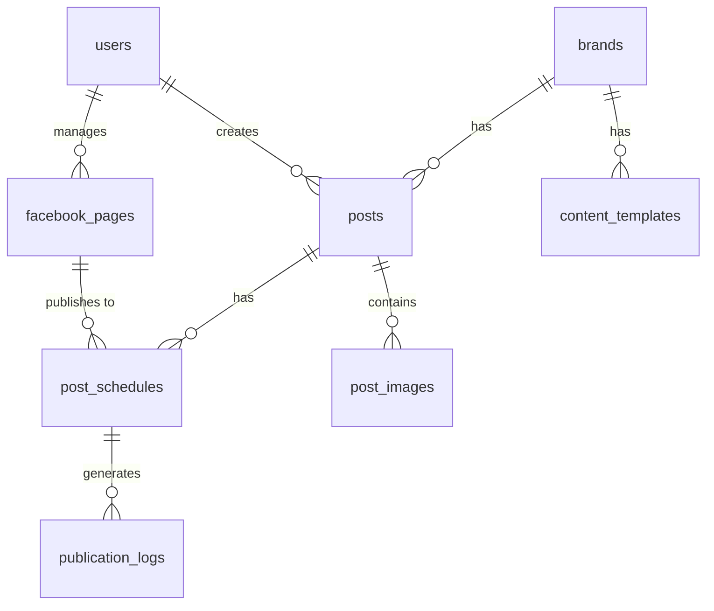

# Thiết kế Database (SQLite) - AI Facebook Content Tool

## Tổng quan
Sử dụng SQLite cho Sprint 0 & MVP. Các bảng được thiết kế để dễ dàng chuyển sang MySQL/PostgreSQL trong tương lai.

## Lược đồ ERD

## Các bảng chi tiết

### 1. `users`
Lưu thông tin người dùng và phân quyền (dự kiến).
- `id` (PK)
- `name` (String)
- `email` (String, Unique)
- `password` (String, Hashed)
- `role` (Enum: `admin`, `content_creator`, `reviewer`)
- `timestamps`

### 2. `brands`
Thông tin các thương hiệu. Dùng để làm context khi sinh prompt AI.
- `id` (PK)
- `name` (String)
- `industry` (String, nullable)
- `description` (Text, nullable)
- `target_audience` (Text, nullable)
- `tone` (String, nullable)
- `slogan` (String, nullable)
- `default_cta` (Text, nullable)
- `default_hashtags` (JSON, nullable)
- `prohibited_terms` (JSON, nullable) - Từ khóa cần tránh
- `timestamps`

### 3. `content_templates`
Lưu trữ các template prompt mẫu theo từng mục tiêu.
- `id` (PK)
- `brand_id` (FK -> brands.id)
- `name` (String)
- `objective` (String)
- `prompt_template` (Text)
- `is_active` (Boolean)
- `timestamps`

### 4. `posts`
Lưu trữ bài viết được tạo ra (từ AI hoặc thủ công).
- `id` (PK)
- `brand_id` (FK -> brands.id)
- `created_by` (FK -> users.id)
- `title` (String)
- `content` (Text)
- `cta` (String, nullable)
- `hashtags` (JSON, nullable)
- `objective` (String)
- `tone` (String)
- `status` (Enum: `draft`, `pending_review`, `revision_required`, `approved`, `scheduled`, `publishing`, `published`, `failed`, `cancelled`)
- `approved_by` (FK -> users.id, nullable)
- `approved_at` (Timestamp, nullable)
- `timestamps`

### 5. `post_images`
- `id` (PK)
- `post_id` (FK -> posts.id)
- `file_path` (String)
- `mime_type` (String)
- `file_size` (Integer)
- `sort_order` (Integer)
- `timestamps`

### 6. `facebook_pages`
Lưu thông tin Fanpage và Token.
- `id` (PK)
- `page_id` (String, Unique)
- `page_name` (String)
- `access_token` (String, Encrypted) - Trường CẦN mã hóa
- `token_expires_at` (Timestamp, nullable)
- `is_active` (Boolean, default: true)
- `timestamps`

### 7. `post_schedules`
Lập lịch đăng bài.
- `id` (PK)
- `post_id` (FK -> posts.id)
- `facebook_page_id` (FK -> facebook_pages.id)
- `scheduled_at` (Timestamp)
- `timezone` (String, default: 'UTC')
- `status` (Enum: `pending`, `processing`, `completed`, `failed`)
- `attempts` (Integer, default: 0)
- `timestamps`

### 8. `publication_logs`
Ghi log quá trình đăng bài lên Meta API.
- `id` (PK)
- `post_id` (FK -> posts.id)
- `facebook_page_id` (FK -> facebook_pages.id)
- `schedule_id` (FK -> post_schedules.id, nullable)
- `facebook_post_id` (String, nullable)
- `status` (Enum: `success`, `error`)
- `error_code` (String, nullable)
- `error_message` (Text, nullable)
- `published_at` (Timestamp, nullable)
- `timestamps`

## Indexes & Constraints đề xuất
- Đánh index cho `status` trong `posts` và `post_schedules` để truy vấn luồng/lên lịch nhanh.
- Đánh index cho `scheduled_at`.
- Trường JSON: `hashtags`, `default_hashtags`, `prohibited_terms`.
- Trường cần mã hóa (Laravel Encryption): `access_token` trong `facebook_pages` để bảo mật.
