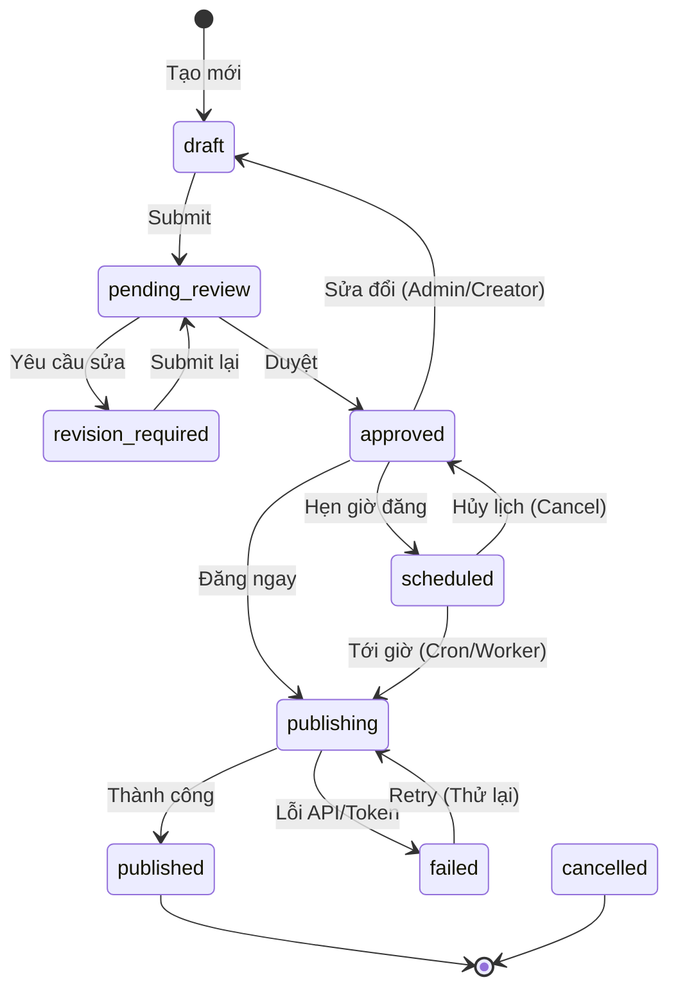

# Vòng đời & Trạng thái Bài viết - AI Facebook Content Tool

Bài viết trong hệ thống AI Facebook Content Tool tuân theo một quy trình kiểm duyệt và đăng tải chặt chẽ.

## Các trạng thái của Bài viết (Post Status)

1. **`draft` (Bản nháp)**
   - Vừa được tạo bằng AI hoặc viết tay.
   - Chỉ người tạo (Content Creator) và Admin mới có thể chỉnh sửa.
2. **`pending_review` (Chờ duyệt)**
   - Người tạo đã gửi bài để yêu cầu Reviewer duyệt.
   - Không thể chỉnh sửa lúc này trừ khi kéo lại nháp.
3. **`revision_required` (Cần chỉnh sửa)**
   - Reviewer không đồng ý và yêu cầu Content Creator sửa lại.
4. **`approved` (Đã duyệt)**
   - Bài viết sẵn sàng để đăng hoặc lên lịch.
5. **`scheduled` (Đã lên lịch)**
   - Đã gán `scheduled_at` và đang chờ tới giờ đăng.
6. **`publishing` (Đang đăng)**
   - Hệ thống Worker đang thực hiện gọi Meta Graph API. Trạng thái tạm thời.
7. **`published` (Đã đăng)**
   - Bài viết đã xuất hiện thành công trên Facebook.
8. **`failed` (Đăng thất bại)**
   - Gọi Meta Graph API lỗi (hết hạn token, mạng lỗi...).
9. **`cancelled` (Đã hủy)**
   - Bài viết bị hủy, không sử dụng nữa.

## Luồng chuyển trạng thái

## Vai trò & Quyền thao tác (Quy định)
- **Content Creator**: Chỉ được đổi từ `draft` -> `pending_review`, và từ `revision_required` -> `pending_review`. Được hủy bài của mình.
- **Reviewer**: Được chuyển từ `pending_review` sang `approved` hoặc `revision_required`.
- **Admin**: Có toàn quyền chuyển trạng thái trong mọi bước (vd: từ `draft` -> `approved` -> `published` bỏ qua Review).

## Xử lý khi đăng thất bại (`failed`)
- Khi bài chuyển sang `failed`, hệ thống sẽ lưu nguyên nhân chi tiết (error code, error message từ Facebook API) vào bảng `publication_logs`.
- Hệ thống có thể cảnh báo qua giao diện.
- Người dùng có thể nhấn nút "Thử lại (Retry)", bài sẽ chuyển về `publishing`. Nếu Facebook Access Token bị hết hạn, người dùng phải Re-connect Page trước khi Retry.
